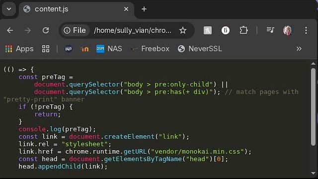

# Chrome Highlight

A simple extension to highlight raw code in chrome.

## TODO

- [x] Dynamic CSS loading with respect to the selected theme
- [ ] Download or link [all supported themes](https://github.com/highlightjs/highlight.js/tree/main/src/styles)
- [ ] Pretty popup selection
- [ ] Build step that fetches highlight.js
    - All themes are available on [npm](https://www.npmjs.com/package/highlight.js?activeTab=readme) and can be fetched at build time.

## Sources

Read from [Google's examples](https://github.com/GoogleChrome/chrome-extensions-samples)

## Vendors

- [Highlight.js v11.10.0](https://cdnjs.cloudflare.com/ajax/libs/highlight.js/11.10.0/highlight.min.js)
- [Monokai Theme](https://cdnjs.cloudflare.com/ajax/libs/highlight.js/11.10.0/styles/monokai.min.css)
- [Nord Theme](https://cdnjs.cloudflare.com/ajax/libs/highlight.js/11.10.0/styles/nord.min.css)
- [GitHub dark Theme](https://cdnjs.cloudflare.com/ajax/libs/highlight.js/11.10.0/styles/github-dark.min.css)
