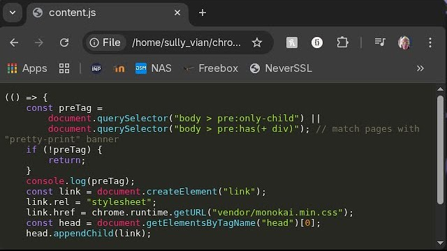

# Medium Rare

Additional features to raw code preview in the browser.



```bash
npm run check # check with Biome

npm run build # build & bundle with Vite
```

## TODO

- [x] Dynamic CSS loading with respect to the selected theme
- [x] Download or link [all supported themes](https://github.com/highlightjs/highlight.js/tree/main/src/styles)
- [ ] Appearance
    - [ ] Pretty popup selection
        - [ ] custom dropdown for mouse wheele selection
        - [ ] fix accents in theme names
    - [ ] Fix notif (borken because of popup styling.
    - [ ] Icon (Typst -> SVG)
- [x] Build step that fetches highlight.js
    - All themes are available on [npm](https://www.npmjs.com/package/highlight.js?activeTab=readme) and can be fetched at build time.
- [x] Popup should automatically list all themes
- [ ] FIX: window freezing on large files
        - [Web Workers](https://github.com/highlightjs/highlight.js?tab=readme-ov-file#using-web-workers)
        - replace highlight.js with [Shiki](https://shiki.style/) (WASM-accelerated)
- [ ] Notifications
    - [x] Notify theme change
    - [ ] Notify hilighting completed
- [x] Auto page reload
- [ ] Dev
    - [ ] different `tsconfig.json` for node and app

## Sources

Read from [Google's examples](https://github.com/GoogleChrome/chrome-extensions-samples)

